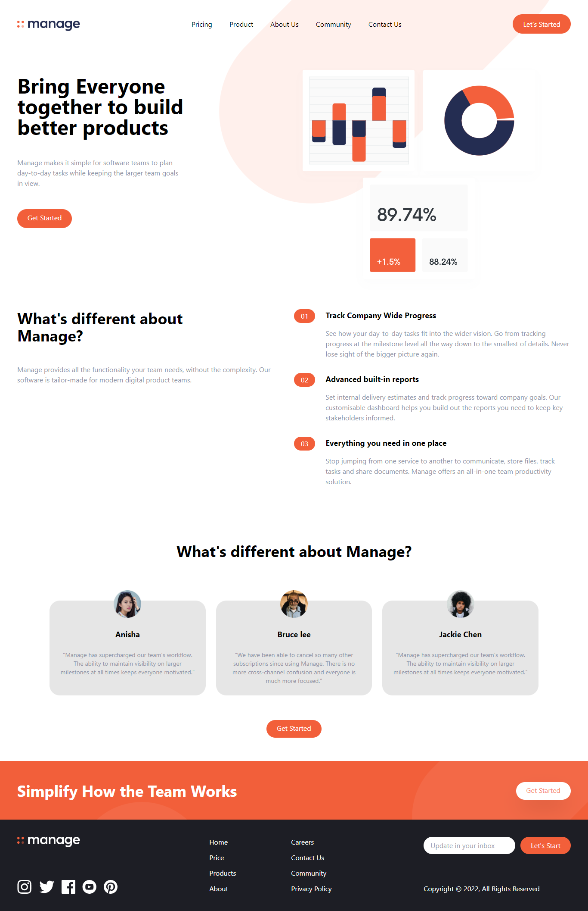
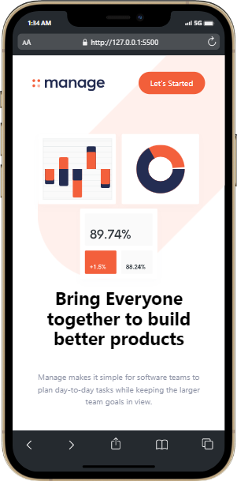
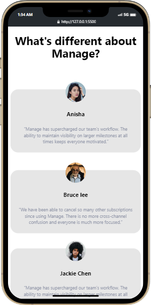

# Manage Landing Page

***
## Description

This project [Manage Landing Page]() was built using Semantic HTML and **Tailwind** from scratch. While building this project I learnt and brushed up the concepts of Tailwind css framework.

***

### Links for Project

* [LIVE Project Link]()

* [Youtube Video Demo]()

* [Source Code]()

***
### Built With 

* Semantic HTML
* Tailwind CSS

***

### Key Learnings

* Learned to make responsive design for all devices without any hassels of media-queries and writing same css again & again
* Learned to read [Tailwinddocs](https://tailwindcss.com/docs/installation) more efficiently
* Used Tailwind components when necessary

***

### Time Taken to finish this project
 

>5 hours to build it from scratch(responsive design).

 

***

### Screencaptures of Project

 

  1. ### Whole Webpage

   

  

   

  2. ### Mobile View

 

 

  3. ### Tablet View 

   

  

   

  

   

  4. ### Large Screen View
 
   

  

   
  
  

   

***

### Checkout Portfolio & Other Projects

#### [Personal Portfolio]()

 

#### [Findcoder Profile]()
***

### Connect with Me
* [Mailto](mailto:shubhambhoj3@gmail.com)
* [LinkedIn](https://www.linkedin.com/in/shubham-singh-b122b7171/)
* [Github](https://github.com/ShubhamSingh03)
* [Findcoder]()
***
***
[go to top](#manage-landing-page)